# Hi, I'm S M Najmul Alam 👋

---

### 👨‍💻 About me

Business Analyst at **Data Edge Ltd.** driving the NRB Bank Oracle FlexCube 14.8 upgradation — doing requirement gap analysis, parameterisation, and UAT across Core, Credit, and Treasury domains. I build AI tools on top of real banking infrastructure: RAG pipelines over Oracle documentation, AI-powered learning platforms, and interoperable payment simulators.

CGPA **3.86 / 4.00** · Merit Scholarship 2022–2026 · BRAC University CSE

---

### 🚀 Featured projects

<table>
<tr>
<td width="50%" valign="top">

**🤖 [Oracle FlexCube Copilot](https://github.com/Najmul193/oracle-flexcube-copilot)**
RAG-powered assistant over 179 Oracle FlexCube PDFs. Hybrid retrieval — dense (ChromaDB) + sparse (BM25) + entity (SQLite) fused via Reciprocal Rank Fusion — served through a Streamlit UI with streaming, citations, and confidence scores.
`Python` `RAG` `Ollama` `ChromaDB` `BM25` `RRF`

</td>
<td width="50%" valign="top">

**🏦 [Flexcube Learn](https://github.com/Najmul193/Flexcube_Learn)**
AI-powered learning platform for Oracle FlexCube 14.8 with "Flexy" — a context-aware assistant, PDF-to-LLM sync, and an adaptive quiz engine built on real banking scenarios.
`TypeScript` `Next.js` `Google Gemini` `AI integration`

</td>
</tr>
<tr>
<td width="50%" valign="top">

**💱 [Custom DFSP for Mojaloop](https://github.com/Najmul193/custom-dfsp)**
Containerised sender/receiver DFSP simulation integrated with the Mojaloop core switch via FSPIOP — enabling full quote → prepare → fulfil → commit transfer testing with three real-time dashboard UIs.
`JavaScript` `Docker` `Mojaloop SDK` `FSPIOP`

</td>
<td width="50%" valign="top">

**🔬 [Machine Vision QA System](https://github.com/Najmul193/WhiteBoard)**
Undergraduate thesis — trained EfficientNet-B0, ResNet-50, and MobileNetV2 via transfer learning, deployed to NVIDIA Jetson Nano + STM32 over UART/CAN for real-time defect sorting at sub-400ms latency.
`Python` `TensorFlow` `EfficientNet` `Jetson Nano` `STM32`

</td>
</tr>
<tr>
<td width="50%" valign="top">

**🌌 [Celestium](https://github.com/Najmul193/Celestium)**
Interactive educational platform celebrating the universe through JWST imagery, poetry, games, and a WebGL VR simulation.
`WordPress` `PHP` `Unity/WebGL`

</td>
<td width="50%" valign="top">

**🧠 [LGG Brain MRI Segmentation](https://github.com/Najmul193/LGG-Brain-MRI-Segmentation-using-Deep-Learning)**
Deep learning brain tumor segmentation on the TCGA-LGG dataset using FLAIR MRI scans and a CNN-based U-Net architecture.
`Python` `TensorFlow` `CNN` `U-Net`

</td>
</tr>
</table>

---

### 🔥 Technical skills

---

### 📊 GitHub stats

---

💬 Open to discuss RAG systems, core banking implementations, or ML deployment on edge hardware.

